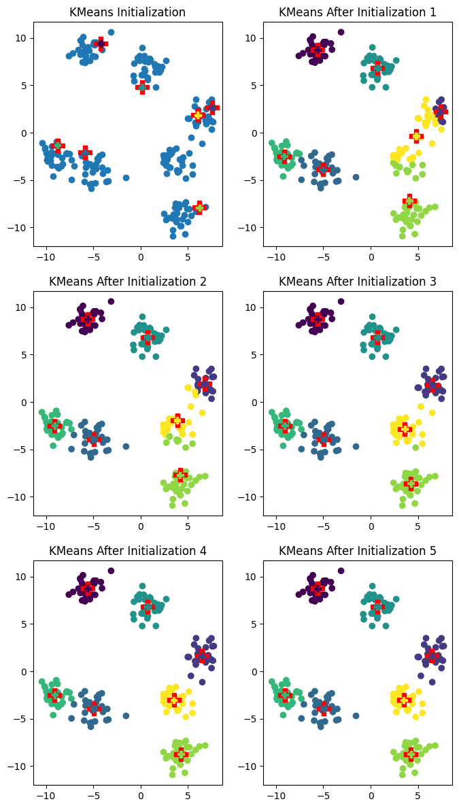

# K-means
This project is the implementation of K-means clustering algorithm for unsupervised machine learning.

## k_means
The algorithm is implemented in `k_means.py`. The main method is
`k_means`.

## k_means_main
The file `k_means_main.py` shows how to use the implemented algorithm on some artificial data.

The example of the invocation of the program is:

`python k_means_main.py --clusters=7 --examples=200 --iterations=5 --seed=67 --init=kmeans++ --plot=plot`

- `clusters` specifies the number of clusters to generate
- `examples` specifies the amount of data points to be generated
- `iterations` is the number of iterations of the K-means algorithm
- `seed` specifies the random seed 
- `init` specifies the initialization of the cluster centers, can be `random` or `kmeans++`
- `plot` is the name of output file of the plot

The result of the previous invocation is the following output file:
